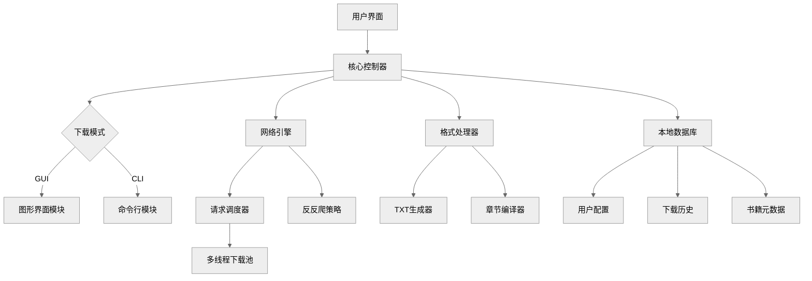

# 📚 番茄小说下载器 | Fanqie Novel Downloader

<div align="center">

[](https://github.com/rabbits0209/Fanqie-novel-Downloader/releases)
[](LICENSE)
[](https://www.python.org)
[](https://github.com/rabbits0209/Fanqie-novel-Downloader/releases)

</div>

---

#请合理使用本软件，开发者创作不易，请勿滥用！

## 🌟 核心特性

### 🚀 全平台支持
| **功能**                 | **描述**                                                                |
|--------------------------|-------------------------------------------------------------------------|
| **📚 内容解析**          | 智能识别章节结构，自动校正格式与标点，支持番茄全平台内容抓取                 |
| **⚡ 高效引擎**          | 多线程下载 + 断点续传，智能调节请求频率，平均下载速度提升 300%              |
| **🎨 多格式输出**        | 原生支持 TXT/EPUB 格式，EPUB 自动生成精美排版，简约大气                          |
| **🔧 跨平台体验**        | 提供预编译二进制包，Windows/macOS/Linux 开箱即用                          |

---

## 🛠️ 快速入门

### 🖥️ 图形界面版
```bash
# 下载对应平台压缩包并解压
Windows: 双击运行 番茄小说下载器.exe
macOS:  右键打开解压后的应用文件
Linux:  终端执行 chmod +x 番茄小说下载器 && ./番茄小说下载器
```

### ⚙️ 开发者模式
```bash
git clone https://github.com/rabbits0209/Fanqie-novel-Downloader.git
cd Fanqie-novel-Downloader && pip install -r requirements.txt
python gui.py  # 启动图形界面
```

---

## 📊 技术架构



### 核心模块说明
- **网络引擎**：基于异步IO实现，智能处理429状态码，动态调整并发量
- **本地数据库**：采用SQLite加密存储，保障用户隐私安全

---

## 📌 高级功能

### ⚡ 性能调优
```yaml
# config.yaml 配置示例
network:
  max_threads: 8           # 最大并发线程数
  retry_times: 3           # 失败重试次数
  timeout: 15              # 请求超时(秒)
  
output:
  epub_template: "default" # 可选: [default, minimal, professional]
  chapter_split: "★"       # 章节分隔符
```

---

## 📜 合规声明

❗ 本项目仅用于技术研究，下载内容24小时内请自觉删除。严禁用于商业用途或侵犯版权，开发者不承担由此产生的法律责任。

---

<div align="center">
  <br>
  
  
  <br><br>
  
  [📚 文档中心](https://github.com/rabbits0209/Fanqie-novel-Downloader/wiki) |
  [🐛 提交问题](https://github.com/rabbits0209/Fanqie-novel-Downloader/issues) |
  [💬 讨论区](https://github.com/rabbits0209/Fanqie-novel-Downloader/discussions)
  
  <sub>© 2025 Fanqie Novel Downloader Project. MIT Licensed.</sub>
</div>
