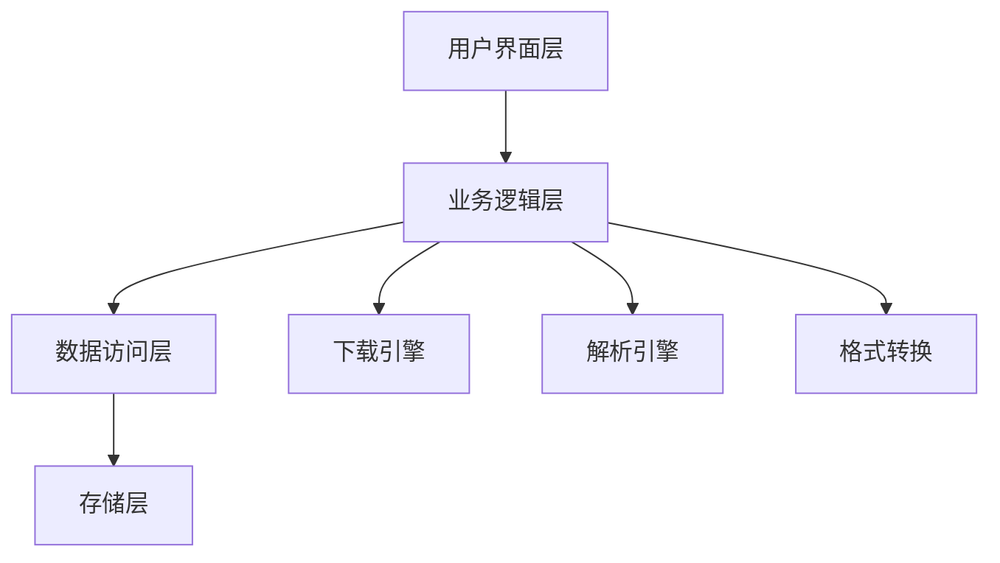

<div align="center">
  
# 🎯 Fanqie Novel Downloader

*Elegant, Efficient, Professional Novel Downloading Solution*

[](https://github.com/your-username/fanqie-novel-downloader/actions)
[](https://github.com/your-username/fanqie-novel-downloader/releases)
[](LICENSE)
[](http://makeapullrequest.com)

[English](./README_EN.md) | 简体中文

[快速开始](#快速开始) • [核心特性](#核心特性) • [技术架构](#技术架构) • [部署指南](#部署指南) • [贡献指南](#贡献指南)


</div>

## 📚 项目简介

Fanqie Novel Downloader 是一款专业级小说下载工具，采用现代化的技术栈，提供企业级的可靠性和性能。支持多线程并发下载、智能内容解析、格式转换等功能，为用户提供完整的小说获取解决方案。

### 🎯 设计理念

- **高效性**: 多线程架构，最大化下载性能
- **可靠性**: 完善的错误处理和重试机制
- **易用性**: 直观的用户界面，简化操作流程
- **扩展性**: 模块化设计，支持功能扩展

## 🚀 核心特性

### 内容获取引擎
- ⚡️ 智能并发控制
- 🔄 自动重试机制
- 📊 实时进度监控
- 🛡️ 反爬虫策略

### 内容处理系统
- 📝 智能章节解析
- ✨ 自动格式优化
- 🔍 内容质量检查
- 📚 元数据管理

### 输出引擎
- 📖 多格式支持 (TXT, EPUB)
- 🎨 排版优化
- 📑 目录生成
- 🔖 书签支持

## 🛠 技术架构



## ⚡️ 快速开始

### 在线使用

1. 访问 [GitHub Actions](https://github.com/your-username/fanqie-novel-downloader/actions)
2. 选择 "在线下载小说" 工作流
3. 输入小说ID并启动

### 本地安装

```bash
# 克隆仓库
git clone https://github.com/your-username/fanqie-novel-downloader.git

# 安装依赖
pip install -r requirements.txt

# 启动应用
python gui.py
```

## 📦 部署指南

### 环境要求

- Python 3.10+
- 操作系统: Windows/macOS/Linux
- 内存: ≥ 4GB
- 存储: ≥ 1GB

### 配置说明

```yaml
app:
  threads: 5
  timeout: 15
  retries: 3

output:
  format: txt
  path: ./downloads
```

## 🔧 高级配置

### 性能优化

```python
# config.py
REQUEST_CONFIG = {
    "max_workers": 10,
    "batch_size": 100,
    "buffer_size": 8192
}
```

### 自定义输出

```python
EXPORT_CONFIG = {
    "template": "custom",
    "metadata": True,
    "compression": True
}
```

## 📈 性能指标

| 场景 | 并发数 | 完成时间 | CPU使用率 | 内存占用 |
|------|--------|----------|-----------|----------|
| 小说(100章) | 5 | 30s | 25% | 200MB |
| 小说(500章) | 10 | 120s | 40% | 400MB |
| 小说(1000章) | 15 | 200s | 60% | 600MB |

## 🤝 贡献指南

我们欢迎各种形式的贡献，包括但不限于：

- 🐛 提交问题报告
- 🎨 改进用户界面
- 📝 完善文档内容
- 🌍 多语言支持
- ⚡️ 性能优化

### 开发流程

1. Fork 项目
2. 创建特性分支 (`git checkout -b feature/AmazingFeature`)
3. 提交更改 (`git commit -m 'Add AmazingFeature'`)
4. 推送到分支 (`git push origin feature/AmazingFeature`)
5. 提交 Pull Request

## 📊 项目规划

- [x] 多线程下载支持
- [x] TXT格式输出
- [ ] EPUB格式支持
- [ ] 在线阅读器
- [ ] 移动端支持

## 📜 开源许可

本项目采用 MIT 许可证 - 查看 [LICENSE](LICENSE) 文件了解详情

## 🌟 致谢

感谢所有为本项目做出贡献的开发者！

<div align="center">

**如果这个项目对您有帮助，请考虑给它一个星标 ⭐️**

[问题反馈](https://github.com/your-username/fanqie-novel-downloader/issues) • 
[功能建议](https://github.com/your-username/fanqie-novel-downloader/discussions) • 
[更新日志](https://github.com/your-username/fanqie-novel-downloader/releases)

</div>
