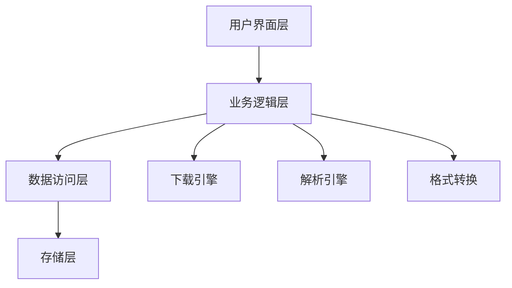

[<div align="center">

# 🎯 Fanqie Novel Downloader

*Elegant, Efficient, Professional Novel Downloading Solution*

[](https://github.com/POf-L/Fanqie-novel-Downloader/actions)
[](https://github.com/POf-L/Fanqie-novel-Downloader/releases)
[](LICENSE)
[](http://makeapullrequest.com)

简体中文

[快速开始](#快速开始) • [核心特性](#核心特性) • [技术架构](#技术架构) • [部署指南](#部署指南) • [贡献指南](#贡献指南)

<!-- 产品演示图将在未来添加 -->

</div>

## 📚 项目简介

Fanqie Novel Downloader 是一款专业级小说下载工具，采用现代化的技术栈，提供企业级的可靠性和性能。支持多线程并发下载、智能内容解析、格式转换等功能，为用户提供完整的小说获取解决方案。

### 🎯 设计理念

- **高效性**: 多线程架构，最大化下载性能
- **可靠性**: 完善的错误处理和重试机制
- **易用性**: 直观的用户界面，简化操作流程
- **扩展性**: 模块化设计，支持功能扩展

## 🚀 核心特性

### 内容获取引擎
- ⚡️ 智能并发控制
- 🔄 自动重试机制
- 📊 实时进度监控
- 🛡️ 反爬虫策略

### 内容处理系统
- 📝 智能章节解析
- ✨ 自动格式优化
- 🔍 内容质量检查
- 📚 元数据管理

### 输出引擎
- 📖 多格式支持 (TXT, EPUB)
- 🎨 排版优化
- 📑 目录生成
- 🔖 书签支持

## 🛠 技术架构



## ⚡️ 快速开始

### 在线使用

1. 访问 [GitHub Actions](https://github.com/POf-L/Fanqie-novel-Downloader/actions)
2. 选择 "在线下载小说" 工作流
3. 输入小说ID并启动

### 本地安装

```bash
# 克隆仓库
git clone https://github.com/POf-L/Fanqie-novel-Downloader.git

# 安装依赖
pip install -r requirements.txt

# 启动应用
python gui.py
```

## 📦 部署指南

### 环境要求

- Python 3.10+
- 操作系统: Windows/macOS/Linux
- 内存: ≥ 4GB
- 存储: ≥ 1GB

### 配置说明

```yaml
app:
  threads: 5
  timeout: 15
  retries: 3

output:
  format: txt
  path: ./downloads
```

## 🔧 高级配置

### 性能优化

```python
# config.py
REQUEST_CONFIG = {
    "max_workers": 10,
    "batch_size": 100,
    "buffer_size": 8192
}
```

### 自定义输出

```python
EXPORT_CONFIG = {
    "template": "custom",
    "metadata": True,
    "compression": True
}
```

## 📈 性能指标

| 场景 | 并发数 | 完成时间 | CPU使用率 | 内存占用 |
|------|--------|----------|-----------|----------|
| 小说(100章) | 5 | 30s | 25% | 200MB |
| 小说(500章) | 10 | 120s | 40% | 400MB |
| 小说(1000章) | 15 | 200s | 60% | 600MB |

## 🤝 贡献指南

我们欢迎各种形式的贡献，包括但不限于：

- 🐛 提交问题报告
- 🎨 改进用户界面
- 📝 完善文档内容
- 🌍 多语言支持
- ⚡️ 性能优化

### 开发流程

1. Fork 项目
2. 创建特性分支 (`git checkout -b feature/AmazingFeature`)
3. 提交更改 (`git commit -m 'Add AmazingFeature'`)
4. 推送到分支 (`git push origin feature/AmazingFeature`)
5. 提交 Pull Request

## 📊 项目规划

- [x] 多线程下载支持
- [x] TXT格式输出
- [ ] EPUB格式支持
- [ ] 在线阅读器
- [ ] 移动端支持

## 📜 开源许可

本项目采用 MIT 许可证 - 查看 [LICENSE](LICENSE) 文件了解详情

## 🌟 致谢

感谢所有为本项目做出贡献的开发者！

<div align="center">

**如果这个项目对您有帮助，请考虑给它一个星标 ⭐️**

[问题反馈](https://github.com/POf-L/Fanqie-novel-Downloader/issues) •
[功能建议](https://github.com/POf-L/Fanqie-novel-Downloader/discussions) •
[更新日志](https://github.com/POf-L/Fanqie-novel-Downloader/releases)

</div>
](https://github.com/POf-L/Fanqie-Tomato-Downloader


# 📚 番茄小说下载器 | Fanqie Novel Downloader

<div align="center">


[](https://github.com/POf-L/Fanqie-Tomato-Downloader/releases)
[](https://github.com/POf-L/Fanqie-Tomato-Downloader/releases)
[](https://github.com/POf-L/Fanqie-Tomato-Downloader/releases)

**🌟 高效、优雅且功能强大的番茄小说下载解决方案 🌟**

[✨ 特性](#-特性) • 
[🚀 快速开始](#-快速开始) • 
[💻 使用指南](#-使用指南) • 
[🔄 自动化构建](#-自动化构建) • 
[❓ 常见问题](#-常见问题) • 
[📜 许可证](#-许可证)


## 🛠 技术架构


</div>

## ✨ 特性

<table>
  <tr>
    <td>
      <h3>📚 高质量内容获取</h3>
      <ul>
        <li>支持番茄小说全平台内容下载</li>
        <li>智能解析章节结构与内容</li>
        <li>自动校正小说格式与标点</li>
      </ul>
    </td>
    <td>
      <h3>🔄 多格式转换</h3>
      <ul>
        <li>支持输出纯净TXT格式</li>
        <li>生成精美排版的EPUB电子书</li>
        <li>保留原书籍章节结构</li>
      </ul>
    </td>
  </tr>
  <tr>
    <td>
      <h3>⚡ 高效下载引擎</h3>
      <ul>
        <li>多线程并发下载技术</li>
        <li>智能调节网络请求频率</li>
        <li>断点续传与状态恢复</li>
      </ul>
    </td>
    <td>
      <h3>🖥️ 界面体验</h3>
      <ul>
        <li>直观友好的图形界面</li>
        <li>实时下载进度可视化</li>
        <li>跨平台一致性体验</li>
      </ul>
    </td>
  </tr>
</table>

## 🚀 快速开始

### 🌐 在线下载（零安装，零依赖）

<details>
<summary><b>点击展开详细步骤</b></summary>

利用GitHub Actions的强大功能，无需在本地安装任何软件即可下载小说：

1. 在GitHub仓库页面，点击 **"Actions"** 选项卡
2. 左侧选择 **"在线下载小说"** 工作流
3. 点击 **"Run workflow"** 按钮
4. 填写以下信息：
   - **小说ID**：从番茄小说网址中获取（例如：`https://fanqienovel.com/page/7105916563` 中的 `7105916563`）
   - **下载线程数**：默认为5，可选1-10
   - **输出格式**：选择txt或epub
5. 点击 **"Run workflow"** 开始下载
6. 下载完成后，点击运行记录中的 **"Summary"** 标签
7. 在 **"Artifacts"** 部分找到并下载小说文件（保存期限为7天）

</details>

### 📦 一键式安装与使用

<details>
<summary><b>点击查看各平台预编译版本</b></summary>

从 [📥 官方发布页](https://github.com/POf-L/Fanqie-Tomato-Downloader/releases) 下载适合您系统的预编译版本：

| 平台 | 下载链接 | 说明 |
|------|---------|------|
| Windows | [`Fanqie-Novel-Downloader-Windows.zip`](https://github.com/POf-L/Fanqie-Tomato-Downloader/releases) | 解压后双击运行 `番茄小说下载器.exe` |
| MacOS | [`Fanqie-Novel-Downloader-MacOS.zip`](https://github.com/POf-L/Fanqie-Tomato-Downloader/releases) | 解压后运行 `番茄小说下载器` 应用 |
| Linux | [`Fanqie-Novel-Downloader-Linux.zip`](https://github.com/POf-L/Fanqie-Tomato-Downloader/releases) | 解压后运行 `番茄小说下载器` 可执行文件 |

</details>

### 💻 从源码运行（开发者选项）

<details>
<summary><b>点击展开开发者指南</b></summary>

```bash
# 1. 克隆代码仓库
git clone https://github.com/POf-L/Fanqie-Tomato-Downloader.git
cd Fanqie-Tomato-Downloader

# 2. 安装依赖库
pip install -r requirements.txt

# 3. 启动应用
python gui.py
```

</details>

## 💻 使用指南

### 🔍 如何查找小说ID

在番茄小说网站上，打开您想要下载的小说页面，URL中的数字部分就是小说ID。

> 例如：`https://fanqienovel.com/page/7105916563` 中的 `7105916563` 就是小说ID。

### 📂 下载文件位置

- **GUI应用**：下载的文件保存在您指定的保存路径中
- **在线下载**：文件将作为GitHub Artifacts提供下载，保存期限为7天

## 🔄 自动化构建

本项目采用现代化的CI/CD流程，通过GitHub Actions自动构建并发布多平台应用。

### ⚙️ 自动构建流程

当创建新的Release或手动触发工作流时，GitHub Actions会自动：

1. 在Windows、MacOS和Linux三大平台进行并行构建
2. 优化可执行文件大小和性能
3. 将构建产物打包为便于分发的压缩文件
4. 上传构建文件并创建正式发布页面

### 🚀 手动触发构建与发布

1. 在GitHub仓库页面，点击 **"Actions"** 选项卡
2. 左侧选择 **"构建与发布"** 工作流
3. 点击 **"Run workflow"** 按钮并填写版本信息
4. 等待自动化流程完成全部构建与发布

## ❓ 常见问题

<details>
<summary><b>遇到下载失败或速度慢的问题</b></summary>

- 尝试减少并行下载线程数
- 确保网络连接稳定
- 对于较长的小说，考虑分批次下载

</details>

<details>
<summary><b>应用无法启动或崩溃</b></summary>

- 确保您下载了正确的操作系统版本
- 检查系统是否满足最低要求
- 尝试重新下载最新版本

</details>

## 📜 许可证

本项目采用 [MIT 许可证](LICENSE) 进行授权和分发。

---

<div align="center">

**⭐ 如果这个项目对您有帮助，请考虑给它一个星标！⭐**

[反馈问题](https://github.com/POf-L/Fanqie-Tomato-Downloader/issues) • 
[贡献代码](https://github.com/POf-L/Fanqie-Tomato-Downloader/pulls) • 
[查看更新](https://github.com/POf-L/Fanqie-Tomato-Downloader/releases)

</div>)
